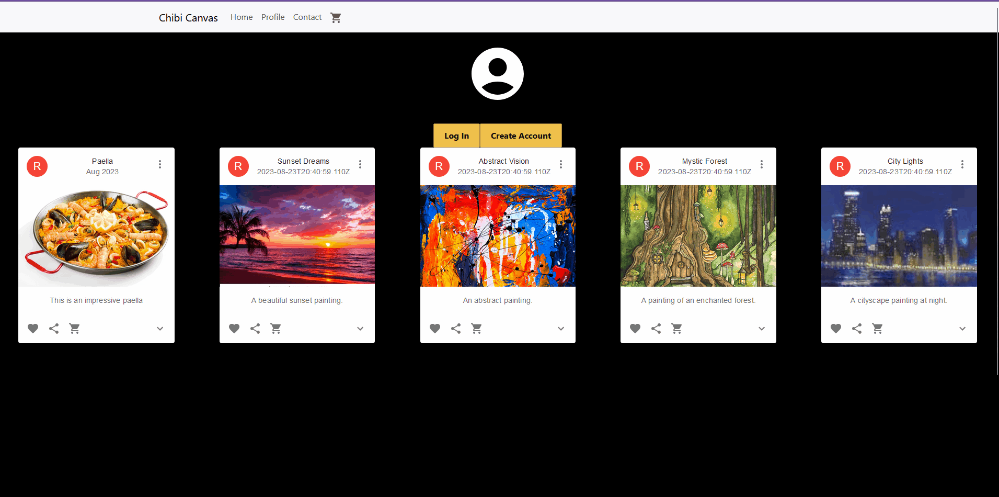

# Chibi Canvas
## This is an ecommerce site for selling and sharing artwork pieces. 
## Created in a team of 4 for Cuny Tech Prep's 2023 Summer Hackathon

## It lets users create/login an account, add or remove art pieces from their cart, sell art pieces, and share them

## Used the PERN stack - PostgreSQL, Express.js, React.js, Node.js

## To run
### First run the backend 
### Make a file called .env and put it inside Backend/
### It will contain the access token and refresh token secret, they should be a random sequence of letters and numbers 128 characters long
```
ACCESS_TOKEN_SECRET = jojssdfsdfmakeupasecretkeyjojssdfsdfmakeupasecretkeyjojssdfsdfmakeupasecretkeyjojssdfsdfmakeupasecretkeyjojssdfsdfmakeupasecretk

REFRESH_TOKEN_SECRET = jojssdfsdfmakeupasecretkeyjojssdfsdfmakeupasecretkeyjojssdfsdfmakeupasecretkeyjojssdfsdfmakeupasecretkeyjojssdfsdfmakeupasecretk
```
### Create a database called ChibiCanvasDB in PostgreSQL and run the Backend/createDB.sql script to create its tables. Then run Backend/initTables.sql for some example data. 
### Make a file called credentials.json and place it inside Backend/src/
```
{
    "user": "postgres",
    "host": "localhost",
    "database": "ChibiCanvasDB",
    "password": "password here",
    "port": 5432
}
```

### PostgreSQL server should be running and then start the backend first
```
cd Backend/
npm install
npm run dev
```

### Alongside the backend, in a seperate terminal, run the front end
```
cd Frontend/
npm install
npm run start
```

## Create account


## Login user


## Check Cart

